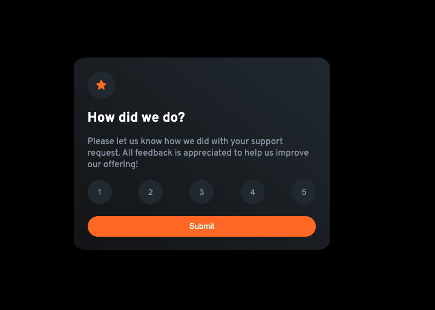

# Frontend Mentor - Interactive rating component solution

This is a solution to the [Interactive rating component challenge on Frontend Mentor](https://www.frontendmentor.io/challenges/interactive-rating-component-koxpeBUmI).

## Table of contents

- [Overview](#overview)
  - [Screenshot](#screenshot)
  - [Links](#links)
- [My process](#my-process)
  - [Built with](#built-with)
  - [What I learned](#what-i-learned)
  - [Continued development](#continued-development)
  - [Useful resources](#useful-resources)
- [Author](#author)
- [Acknowledgments](#acknowledgments)

## Overview

An interactive rating component that allows a user to submit a rating from a scale of 1-5. Once submitted, they will be faced with a "Thank You" message.

### Screenshot

### Links

- Solution URL: [https://github.com/rachelpr/interactive-rating-component](https://github.com/rachelpr/interactive-rating-component)
- Live link: [https://shiny-snickerdoodle-d8f2f0.netlify.app/](https://shiny-snickerdoodle-d8f2f0.netlify.app/)

## My process
1. First I wrote the HTML for the site in index.html, starting with the rating component 
2. I then wrote out some basic styling to get layout.css going
3. From here I worked on getting the number clicked on to show the right styles
4. Then I started applying the functionality for rendering the "Thank You" component
5. Once I got the "Thank You" component mostly working I fixed up the styles for it
6. Lastly, I worked on getting the components to render properly for mobile devices

### Built with

- Semantic HTML5 markup
- CSS custom properties
- Flexbox
- JQuery

### What I learned

- Working with jQuery was fun, but challenging
- Responsive design takes time to perfect

### Continued development

I definitely want to focus on becoming better at responsive designs. Any tips are greatly appreciated!

## Author

- Frontend Mentor - [@rachelpr](https://www.frontendmentor.io/profile/rachelpr)
- Github - [@rachelpr](https://github.com/rachelpr)